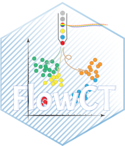

# FlowCT: A semi-automated workflow for deconvolution of immunophenotypic data and objective reporting on large datasets 


`FlowCT` is a semi-automated pipeline for flow cytometry data analysis. Starting from compensated data obtained with standardized protocols, allows simultaneous analyses of multiple files, automated cell clustering and statistical analysis. It provides results in tabular format that can be exported into other databases for integrated analysis (e.g. clinical trials).

## Installation
```
devtools::install_github("paiva-s-lab/FlowCT")
```

## Tutorial
[Here](https://github.com/paiva-s-lab/FlowCT/blob/v1/tutorial.md)

## Issue reporting

In [this repo](https://github.com/paiva-s-lab/FlowCT/issues) for official version.

In [jgarces02/FlowCT](https://github.com/jgarces02/FlowCT) for version under development (also for new suggestions!)

## Citation
Cirino Botta, Catarina Da Silva Maia, Juan-José Garcés _et al._. **FlowCT for the analysis of large immunophenotypic datasets and biomarker discovery in cancer immunology**. _Blood Advances_ 2021. 

https://doi.org/10.1182/bloodadvances.2021005198
