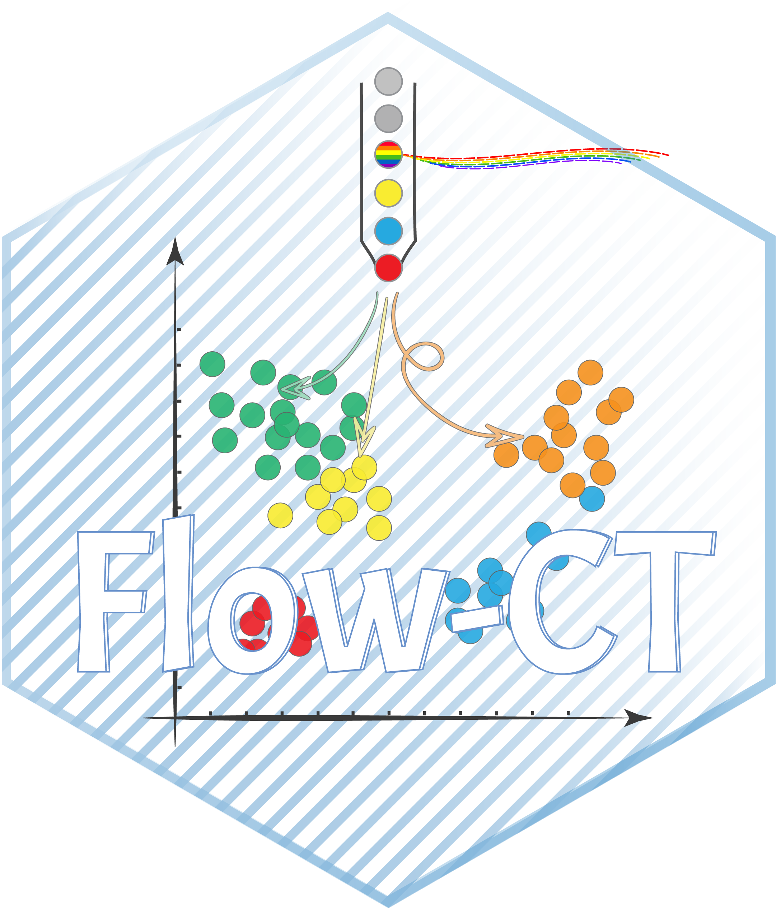

# FlowCT: A semi-automated workflow for deconvolution of immunophenotypic data and objective reporting on large datasets 

_Version: 1.0_

[]

FlowCT is a semi-automated pipeline for flow cytometry data analysis. 
Starting from compensated data obtained with standardized protocols, allows simultaneous analyses of multiple files, automated cell clustering and statistical analysis. It provides results in tabular format that can be exported into other databases for integrated analysis (e.g. clinical trials).
